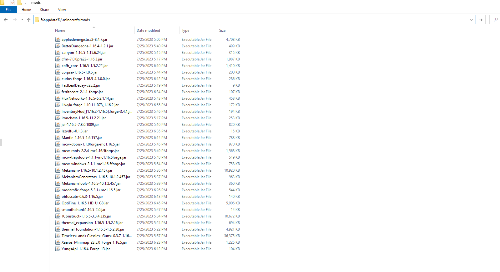

# Installation
- Run `JavaSetup8u381.exe` and follow installation setup

- Run `forge-1.16.5-36.2.39-installer.jar` and select client

- Navigate to `%appdata%/.minecraft/mods` folder (If the mods folder is not present in the .minecraft folder, create it.)

- Copy contents from mod-1.16.5 into mods folder

- Launch Mincraft Launcher and enjoy!